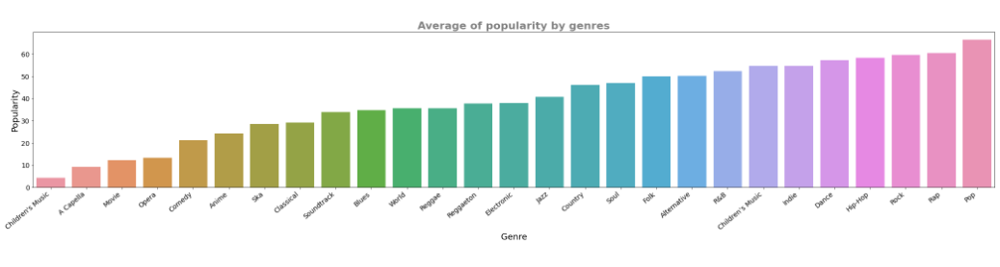
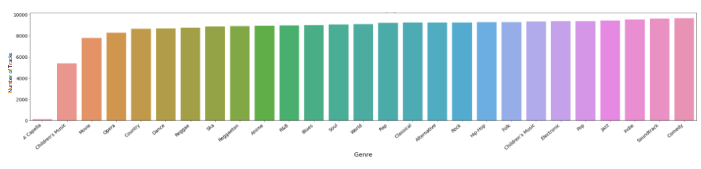
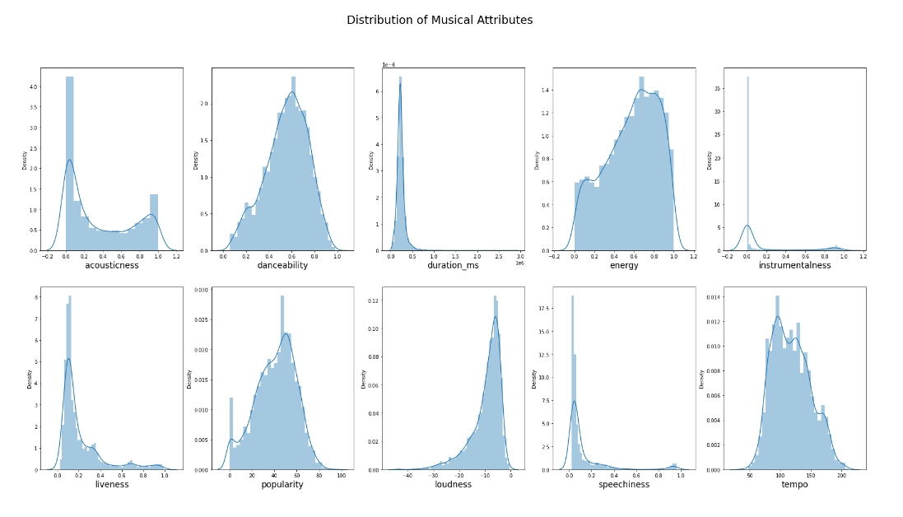

# Music Trends Analysis *(Python, Jupyter Notebook)*
## Skills applied
*Python libraries, Exploratory Data analysis, Data cleaning, Data visualization, Documentation*
## Project Overview
- Understanding the distribution of musical attributes: EDA can help to understand the distribution of various musical attributes such as tempo, loudness, and energy in the dataset. By visualizing these distributions, we can gain insights into the characteristics of the music in the dataset and identify any outliers or anomalies.
- Identifying patterns and relationships between attributes.
- Evaluating the quality of the data.
- The libraries used were **pandas, numpy, matplotlib and seaborn**.
- You can access the Jupiter Notebook at this [LINK](https://github.com/subhojitdas859/Music_Trends_Analysis/tree/main/files)
### Questions that drive my Analysis:
- What people are listening to on Spotify?
- What kind of music genres are popular?
- Which genre has more tracks than others?
- How long are most tracks?
### Preparation and Cleaning:
- After importing the libraries we prepared the data for analysis.
- Elimination of negative values and useless columns.
- Exploration of the correlation of data.

According to this heat map, the highest correlation you can see is between loudness and energy which is (0.82). Also, the popularity has high correlations with loudness (0.36), danceability (0.26), and energy (0.25). That is similar to valence, which has high correlations with danceability (0.55), energy (0.44), and loudness (0.4). To the contrary, it has the least correlation with acousticness. **This could indicate that songs favoured on Spotify might be danceable, loud, and energetic. It could be Hip-Hop, Electronic, or Dance. For example, you can think of the fact that still many people love classic, Rock, or Blues.**
## EDA
During the exploratory data analysis, I focused on answering specific questions mentioned above and were able to draw several significant conclusions. These findings are summarized and presented below:

- **Sum up popularity by genre.**

Rock, Pop, and Rap are the most liked types of music according to this list. But if we had more recent information about the most famous types of music in the world, the results could be different.

- **Number of tracks by genre.**

When we look at the graphs showing how popular different types of music are, we can see that some types of music are not very popular. These include comedy, soundtrack, and indie music. But even though these types of music are not popular, they still have a lot of songs available to listen to. The only types of music that have significantly fewer songs are A Capella and Children's music. Actually, there are two different categories for Children's music, and if we combine them, they have the most songs available.

- **Correlation with popularity and distribution of each genre:** Make plots of correlation with Popularity, and that of distribution of each categories.

Strong correlation between popularity and loudness is clearly seen in this scatter plot too.

Popularity and danceability are closer to the normal distribution than others. Acousticity is clearly bimodal, liveness is skewed to the left, and loudness is skewed to the right. Because duration-ms is mostly between 0.0 and 1.0, I'll make a separate plot for this.
- **How long are most tracks?**

I removed outliers and only displayed those that were less than 10 minutes long. The average track lasts about 4 minutes, with most tracks lasting between 2 and 6 minutes. This may change significantly if there are more classic or other old tracks in this dataset.
## Conclusion
The data shows that most people on Spotify prefer to listen to music that is **loud, energetic, and good for dancing.** This is true no matter how many songs there are in each genre. Of course, other datasets might show something different. But since Spotify is one of the most popular music services, this could be a sign of what people will keep liking in the future, which can help us to **produce a hit song** and create more tailored and effective music marketing strategies. Unless something new and really popular comes up!
